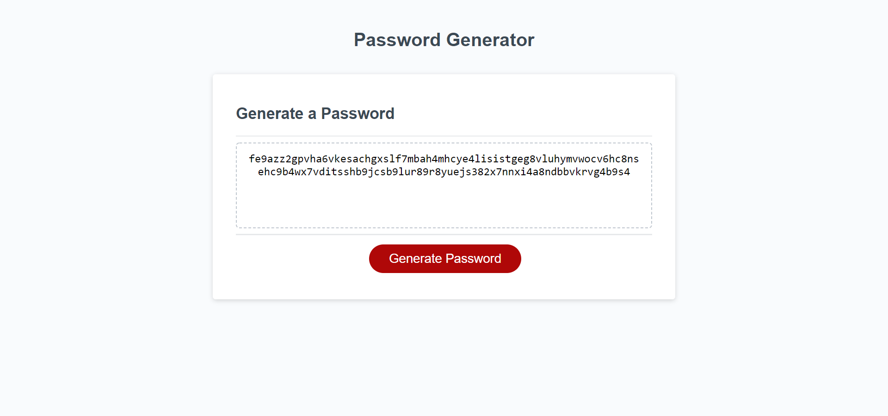

# JavaScript Password Generator

## Overview

This interactive password generator is designed to generate random passwords for employees to improve account security. 

### Features
- Interactive user interface that is accessible in the browser
- click a button to generate a password
- User is prompted to answer a series of questions that describe their desired password output. 
- Passwords must be between 8 and 128 characters.
- Passwords can contain numbers, special characters, upper and/or lower case letters. 
- When all prompts are answered, a password will be generated that meets the user's desired criteria. 
- The password is written to the page for the user to copy. 

### Project Flow
- 4 arrays are defined as global variables that store: special characters, numbers, lowercase letters, uppercase letters.
- When a user wants to generate a password, the generatePassword function is run. 
- The user is prompted for how many characters their password needs to be. A while loop is used to ensure the input is a number between 8 and 128. 
- Upon valid input, the user is then prompted for several questions about their password. Do you want numbers in your password? special characters? uppercase letters? lowercase letters? 
- For each prompted that returns true, the arrays that contain the related grouping of characters are added to a new blank array, "chars". 
- Next, a for loop is used to generate the random password. 
- A helper function was created to generate a random number between 1 and the length of the chars array.
- The for loop uses the random number to take random character from the chars array, and put it in the passwordOutput array. 
- The for loop runs a set number of times, depending on how many characters the user requested to be in their password. 
- Lastly, the generatePassword function returns the joined letters of the passwordOutput array.
- The password is then displayed on the page by manipulating the DOM. 

### Project URL

URL: https://zacktmiller92.github.io/password-generator/index.html

